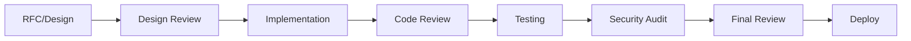

# Agent Workflow Guide for Tapestry Development

## Quick Reference

This guide provides practical, copy-paste prompts for using Tapestry's
specialized agents to build MCP tools following our architecture and standards.

## Table of Contents

1. [Agent Overview](#agent-overview)
2. [Development Phases](#development-phases)
3. [Copy-Paste Prompts](#copy-paste-prompts)
4. [Multi-Terminal Workflows](#multi-terminal-workflows)
5. [Troubleshooting](#troubleshooting)
6. [Best Practices](#best-practices)

## Agent Overview

### Available Agents

| Agent                | Role             | Focus Areas                                | When to Use                               |
| -------------------- | ---------------- | ------------------------------------------ | ----------------------------------------- |
| **Design Reviewer**  | System Architect | Architecture, API design, scalability      | Before implementation, design validation  |
| **Rust Expert**      | Senior Developer | Code quality, safety, performance          | Implementation, code review, optimization |
| **Test Writer**      | QA Engineer      | Test coverage, edge cases, benchmarks      | After implementation, before deployment   |
| **Security Auditor** | Security Expert  | Vulnerabilities, input validation, secrets | Before production, periodic audits        |

### Agent Activation

Always start your prompt with one of these phrases:

- `"Act as the Design Reviewer agent..."`
- `"Act as the Rust Expert agent..."`
- `"Acting as the Test Writer agent..."`
- `"As the Security Auditor agent..."`

## Development Phases

### Phase Flow



## Copy-Paste Prompts

### 📋 Phase 1: RFC and Design Review

#### 1.1 Initial RFC Review

```markdown
Act as the Design Reviewer agent. Review this RFC for [TOOL NAME]:

[Paste RFC content or reference: docs/design/features/RFC-XXX-name.md]

Provide your assessment covering:

1. Architecture compliance (hexagonal)
2. API design quality
3. Scalability concerns
4. Comparison with S-tier practices
5. Risk assessment
6. Recommendations

Use your standard review format with sections for Strengths ✅, Concerns ⚠️,
Critical Issues ❌, and Verdict.
```

#### 1.2 Architecture Deep Dive

```markdown
Act as the Design Reviewer agent. For the [TOOL NAME] tool, create a detailed
architecture design that includes:

1. Domain entities and their relationships
2. Port interfaces (traits) with method signatures
3. Adapter responsibilities
4. Data flow diagram
5. Error handling strategy
6. Performance considerations

Ensure this follows our hexagonal architecture with dependencies flowing inward.
```

#### 1.3 API Contract Definition

```markdown
Act as the Design Reviewer agent. Define the complete API contract for [TOOL
NAME]:

1. All public interfaces (traits)
2. Data structures (request/response)
3. Error types and when they occur
4. Validation rules
5. Example usage scenarios

Follow Stripe's principle: "someone should be able to integrate with seven lines
of code."
```

### 🦀 Phase 2: Implementation

#### 2.1 Domain Logic Implementation

```markdown
Act as the Rust Expert agent. Implement the domain logic for [TOOL NAME].

Start with src/tools/[tool_name]/domain.rs:

Requirements:

- Pure business logic (no external dependencies)
- Use only std library in domain
- Comprehensive error handling (no unwrap/expect)
- Follow team conventions from .claude/context/team-conventions.md

Reference the approved design: [paste design or reference]

Provide complete, production-ready code with inline documentation.
```

#### 2.2 Port Interface Implementation

```markdown
Act as the Rust Expert agent. Implement the port interfaces for [TOOL NAME].

Create src/tools/[tool_name]/port.rs:

Requirements:

- Use async-trait for async interfaces
- Return Result<T, Error> for all fallible operations
- Define clear trait boundaries
- Include documentation with examples

Base this on the domain logic in domain.rs and the API contract from the design
phase.
```

#### 2.3 MCP Adapter Implementation

```markdown
Act as the Rust Expert agent. Implement the MCP adapter for [TOOL NAME].

Create src/tools/[tool_name]/adapter.rs:

Requirements:

- Implement rmcp::Tool trait
- Handle MCP protocol serialization/deserialization
- Map between MCP types and domain types
- Proper error conversion and context
- Follow the pattern in .claude/context/architecture.md

The adapter should use the port interfaces and delegate to domain logic.
```

#### 2.4 Integration Module

```markdown
Act as the Rust Expert agent. Create the module integration for [TOOL NAME].

Create src/tools/[tool_name]/mod.rs:

Requirements:

- Public API exports
- Module documentation
- Factory function for creating the tool
- Re-export necessary types

Also update src/tools/mod.rs to include this module.
```

### 🔍 Phase 3: Code Review

#### 3.1 Safety and Correctness Review

```markdown
Act as the Rust Expert agent. Perform a safety and correctness review of this
code:

[Paste code or reference: src/tools/[tool_name]/]

Focus on:

1. Memory safety (no unsafe without justification)
2. Error handling (no panics possible)
3. Thread safety (Send/Sync correct)
4. Resource cleanup (no leaks)
5. Data race prevention

Provide line-by-line feedback with specific fixes for any issues found.
```

#### 3.2 Performance Review

```markdown
Act as the Rust Expert agent. Review this code for performance:

[Paste code or reference]

Analyze:

1. Unnecessary allocations (String vs &str)
2. Inefficient data structures
3. Blocking operations in async code
4. Clone usage in hot paths
5. Iterator vs loop efficiency

Provide specific optimizations with before/after code examples.
```

#### 3.3 Idiomatic Rust Review

```markdown
Act as the Rust Expert agent. Review this code for Rust idioms:

[Paste code or reference]

Check for:

1. Proper use of Option/Result combinators
2. Iterator chains vs loops
3. Pattern matching usage
4. Ownership patterns
5. Trait usage for abstraction

Suggest idiomatic improvements with explanations.
```

### 🧪 Phase 4: Testing

#### 4.1 Test Plan Creation

```markdown
Act as the Test Writer agent. Create a comprehensive test plan for [TOOL NAME]:

Based on the implementation in src/tools/[tool_name]/, define:

1. Unit tests for domain logic
2. Integration tests for adapters
3. Property-based tests for complex logic
4. Performance benchmarks
5. Edge cases and error conditions

Provide specific test functions with descriptive names and purposes.
```

#### 4.2 Unit Test Implementation

```markdown
Act as the Test Writer agent. Implement unit tests for [TOOL NAME].

Create src/tools/[tool_name]/domain.rs tests:

Requirements:

- Test all public functions
- Test error conditions
- Test edge cases (empty, max size, etc.)
- Use descriptive test names
- Follow arrange-act-assert pattern

Provide complete test module with all necessary tests.
```

#### 4.3 Integration Test Implementation

```markdown
Act as the Test Writer agent. Implement integration tests for [TOOL NAME].

Create tests/[tool_name]\_integration.rs:

Requirements:

- Test MCP protocol integration
- Test with real git repositories (for git tools)
- Test async behavior
- Test error propagation
- Test performance targets (<100ms P50)

Include setup/teardown helpers as needed.
```

### 🔒 Phase 5: Security Audit

#### 5.1 Security Review

```markdown
Act as the Security Auditor agent. Perform a security audit of [TOOL NAME]:

Review src/tools/[tool_name]/ for:

1. Input validation and sanitization
2. Secret handling (no logging secrets)
3. Path traversal vulnerabilities
4. Command injection risks
5. Resource exhaustion attacks
6. Authentication/authorization if applicable

Provide specific vulnerabilities found and remediation steps.
```

#### 5.2 Threat Modeling

```markdown
Act as the Security Auditor agent. Create a threat model for [TOOL NAME]:

Consider:

1. Attack surface (what inputs does it accept?)
2. Trust boundaries (what external systems does it call?)
3. Data sensitivity (what data does it handle?)
4. Potential abuse scenarios
5. Mitigation strategies

Provide a risk matrix with likelihood and impact ratings.
```

### ✅ Phase 6: Final Integration

#### 6.1 Architecture Compliance Check

```markdown
Act as the Design Reviewer agent. Perform final architecture review of [TOOL
NAME]:

Verify:

1. Hexagonal architecture properly implemented
2. Dependencies flow inward only
3. Domain has no external dependencies
4. Ports clearly define contracts
5. Adapters properly isolated
6. Ready for extraction to microservice

Compare implementation against original RFC and design. Provide final approval
or required changes.
```

#### 6.2 Documentation Review

```markdown
Act as the Documentation agent. Review and complete documentation for [TOOL
NAME]:

Check:

1. README.md updated with new tool
2. Public API documentation complete
3. Examples provided for common usage
4. Error messages are helpful
5. Configuration documented
6. CHANGELOG.md updated

Provide any missing documentation.
```

## Multi-Terminal Workflows

### Parallel Development (Advanced)

Use multiple terminal windows with different agents:

#### Terminal 1: Design Lead

```bash
# Focus on architecture and design
"Act as the Design Reviewer agent. I'll be reviewing and guiding the implementation of [TOOL NAME]."
```

#### Terminal 2: Implementation Lead

```bash
# Focus on writing code
"Act as the Rust Expert agent. I'll be implementing [TOOL NAME] based on the approved design."
```

#### Terminal 3: Quality Lead

```bash
# Focus on testing and quality
"Act as the Test Writer agent. I'll be creating tests for [TOOL NAME] as it's implemented."
```

### Sequential Handoffs

#### Handoff from Design to Implementation

```markdown
Design Reviewer: "I've completed the design review. Here's the handoff to
implementation:

APPROVED DESIGN ELEMENTS:

- Domain entities: [list]
- Key interfaces: [list]
- Critical patterns to follow: [list]
- Performance targets: [list]

IMPLEMENTATION REQUIREMENTS:

- Must use: [specific patterns/libraries]
- Must avoid: [anti-patterns]
- Must test: [critical paths]

The Rust Expert should now implement following these guidelines."
```

#### Handoff from Implementation to Testing

```markdown
Rust Expert: "Implementation complete. Here's the handoff to testing:

IMPLEMENTED FEATURES:

- Core functionality: [list]
- Error conditions handled: [list]
- Performance optimizations: [list]

TESTING FOCUS AREAS:

- Complex logic in: [functions]
- Edge cases: [list]
- Integration points: [list]

The Test Writer should create comprehensive tests for these areas."
```

## Troubleshooting

### Common Issues and Solutions

#### Agent Not Following Role

**Problem**: Agent isn't acting in character or using wrong expertise.
**Solution**: Be more explicit with role activation:

```markdown
"You are now the Design Reviewer agent as defined in
.claude/agents/design-reviewer.md. Review this design:"
```

#### Inconsistent Reviews

**Problem**: Agent gives different feedback on similar code. **Solution**:
Reference specific standards:

```markdown
"Act as the Rust Expert agent. Use the checklist from your definition to review
this code systematically:"
```

#### Missing Context

**Problem**: Agent doesn't reference project-specific patterns. **Solution**:
Explicitly provide context:

```markdown
"Act as the Design Reviewer agent. Review this considering our hexagonal
architecture in .claude/context/architecture.md:"
```

#### Handoff Confusion

**Problem**: Next agent doesn't understand previous agent's work. **Solution**:
Create explicit handoff documents:

```markdown
"Summarize your review findings for the next agent to implement:"
```

## Best Practices

### 1. Start Each Session with Context

```markdown
"Act as [AGENT]. We're working on [TOOL NAME] which [BRIEF DESCRIPTION]. The
current phase is [PHASE]. Previous work: [SUMMARY]."
```

### 2. Use Agent Memory

Create memory files for each agent to track patterns:

```bash
.claude/agents/memory/
├── design-patterns-that-work.md
├── rust-gotchas-found.md
└── test-scenarios-effective.md
```

### 3. Regular Sync Points

After each major phase, sync all agents:

```markdown
"All agents: Given the current state of [TOOL NAME], what are your observations
and recommendations for the next phase?"
```

### 4. Iterative Refinement

Don't expect perfection in one pass:

```markdown
"Act as the Rust Expert agent. Review your own implementation and identify three
improvements:"
```

### 5. Document Decisions

Have agents document why they made specific choices:

```markdown
"Explain why you chose [PATTERN/APPROACH] over alternatives:"
```

## Example: Complete Workflow for Git Workflow Tool

### Day 1: Design

```markdown
Morning: "Act as the Design Reviewer agent. Review RFC-001 for the Git Workflow
tool and identify critical design decisions needed."

Afternoon: "Act as the Design Reviewer agent. Create detailed architecture for
the Git Workflow tool's change analysis feature."
```

### Day 2: Implementation

```markdown
Morning: "Act as the Rust Expert agent. Implement the domain logic for Git
Workflow tool starting with CommitPlan and ChangeAnalysis."

Afternoon: "Act as the Rust Expert agent. Implement the GitWorkflowPort trait
and create the MCP adapter."
```

### Day 3: Review and Testing

```markdown
Morning: "Act as the Rust Expert agent. Review the Git Workflow implementation
for safety, performance, and idioms."

Afternoon: "Act as the Test Writer agent. Create comprehensive tests for the Git
Workflow tool."
```

### Day 4: Integration

```markdown
Morning: "Act as the Security Auditor agent. Review Git Workflow tool for
security vulnerabilities."

Afternoon: "Act as the Design Reviewer agent. Final architecture compliance
check for Git Workflow tool."
```

## Quick Command Reference

### Activation Commands

- `"Act as the Design Reviewer agent..."`
- `"Act as the Rust Expert agent..."`
- `"Acting as the Test Writer agent..."`
- `"As the Security Auditor agent..."`

### Handoff Commands

- `"Provide handoff notes for the [NEXT AGENT]"`
- `"Summarize findings for implementation"`
- `"Document decisions for future reference"`

### Review Commands

- `"Review this code using your standard checklist"`
- `"Provide line-by-line feedback"`
- `"Score this on your standard metrics"`

### Fix Commands

- `"Fix the issues you identified"`
- `"Implement the improvements you suggested"`
- `"Apply the patterns you recommended"`

---

**Remember**: Agents are tools to ensure quality and consistency. Use them
systematically, provide clear context, and maintain explicit handoffs between
phases for best results.
