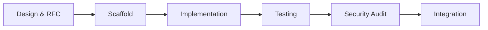

# Command: Create MCP Tool

**Name**: create-mcp-tool  
**Description**: Scaffold a new MCP tool following Tapestry standards with
agent-driven workflow  
**Parameters**: `$TOOL_NAME`, `$DESCRIPTION`  
**Example**: `/create-mcp-tool code-reviewer "Reviews code for best practices and security issues"`

---

## Overview

This command orchestrates the creation of a new MCP tool using our agent
workflow and cargo scaffolding. It follows our hexagonal architecture and S-tier
practices.

## Workflow Phases



---

## Phase 1: Design & RFC (Design Reviewer Agent)

**Agent**: Act as the Design Reviewer agent.

### Step 1.1: Validate Tool Concept

Review the tool concept:

- Does this tool align with Tapestry's vision?
- Is it complementary to existing tools?
- Does it follow MCP best practices?

### Step 1.2: Create RFC

```bash
# Create RFC document
RFC_NUMBER=$(ls docs/design/features/RFC-*.md 2>/dev/null | wc -l | xargs -I {} expr {} + 1)
RFC_NAME="RFC-$(printf "%03d" $RFC_NUMBER)-$TOOL_NAME.md"

cat > docs/design/features/$RFC_NAME << 'EOF'
# RFC-XXX: $TOOL_NAME Tool

## Summary
$DESCRIPTION

## Motivation
[Why do we need this tool?]

## Design

### Domain Model
[Core entities and logic]

### API Contract
[Input/Output structures]

### Architecture
[How it fits hexagonal pattern]

## Implementation Plan
[Phases and milestones]
EOF

echo "Created RFC: docs/design/features/$RFC_NAME"
```

**Design Reviewer Output**: Provide architecture design with domain entities,
port interfaces, and data flow.

---

## Phase 2: Scaffold Structure (Automated)

### Step 2.1: Create Tool Crate Structure

```bash
# Convert kebab-case to snake_case for Rust crate name
TOOL_MODULE=$(echo "$TOOL_NAME" | tr '-' '_')

# Create the tool crate directory
mkdir -p mcp/$TOOL_MODULE/src/{domain,port,adapter}
mkdir -p mcp/$TOOL_MODULE/tests/{unit,integration}
mkdir -p mcp/$TOOL_MODULE/benches

# Create Cargo.toml for the tool
cat > mcp/$TOOL_MODULE/Cargo.toml << EOF
[package]
name = "$TOOL_MODULE"
version = "0.1.0"
edition = "2021"

[dependencies]
tokio = { workspace = true }
anyhow = { workspace = true }
thiserror = { workspace = true }
serde = { workspace = true }
async-trait = { workspace = true }

[dev-dependencies]
tempfile = { workspace = true }
EOF

echo "✅ Created crate structure for $TOOL_NAME"
```

### Step 2.2: Add to Cargo.toml if needed

```bash
# Check if we need to add any dependencies
if ! grep -q "async-trait" Cargo.toml; then
    cargo add async-trait
fi

if ! grep -q "thiserror" Cargo.toml; then
    cargo add thiserror
fi

if ! grep -q "tracing" Cargo.toml; then
    cargo add tracing
fi

# Add dev dependencies for testing
cargo add --dev tempfile
cargo add --dev proptest
cargo add --dev criterion --features html_reports

echo "✅ Updated Cargo.toml dependencies"
```

### Step 2.3: Workspace Auto-Discovery

```bash
# The workspace Cargo.toml already includes mcp/*
# so the new crate is automatically discovered
echo "✅ Tool crate will be auto-discovered by workspace"
```

---

## Phase 3: Implementation (Rust Expert Agent)

**Agent**: Act as the Rust Expert agent.

### Step 3.1: Implement Domain Layer

**Rust Expert Task**: Implement pure domain logic with no external dependencies.

Generate `mcp/$TOOL_MODULE/src/domain.rs`:

```rust
//! Domain logic for $TOOL_NAME
//!
//! $DESCRIPTION

use serde::{Deserialize, Serialize};
use thiserror::Error;

/// Input for the $TOOL_NAME tool
#[derive(Debug, Clone, Deserialize, Serialize)]
pub struct ${ToolName}Input {
    // TODO: Define input fields
}

/// Output from the $TOOL_NAME tool
#[derive(Debug, Clone, Deserialize, Serialize)]
pub struct ${ToolName}Output {
    // TODO: Define output fields
}

/// Errors specific to $TOOL_NAME
#[derive(Error, Debug)]
pub enum ${ToolName}Error {
    #[error("Invalid input: {0}")]
    InvalidInput(String),

    // TODO: Add tool-specific errors
}

/// Core domain service for $TOOL_NAME
pub struct ${ToolName}Service {
    // TODO: Add any required state
}

impl ${ToolName}Service {
    /// Creates a new instance of the service
    pub fn new() -> Self {
        Self {
            // TODO: Initialize state
        }
    }

    /// Executes the core logic
    ///
    /// # Arguments
    /// * `input` - The input parameters
    ///
    /// # Returns
    /// The result of the operation
    ///
    /// # Errors
    /// Returns `${ToolName}Error` if the operation fails
    pub fn execute(&self, input: ${ToolName}Input) -> Result<${ToolName}Output, ${ToolName}Error> {
        // TODO: Implement core logic
        // This should be pure business logic with no external dependencies

        todo!("Implement $TOOL_NAME logic")
    }
}

// Note: Tests go in tests/ directory, not inline!
```

### Step 3.2: Define Port Interface

**Rust Expert Task**: Create clean trait boundaries for dependency injection.

In `port.rs`, create the interface:

```rust
//! Port definitions for $TOOL_NAME

use async_trait::async_trait;
use anyhow::Result;
use super::domain::{${ToolName}Input, ${ToolName}Output};

/// Port interface for $TOOL_NAME
#[async_trait]
pub trait ${ToolName}Port: Send + Sync {
    /// Executes the tool operation
    async fn execute(&self, input: ${ToolName}Input) -> Result<${ToolName}Output>;

    /// Returns tool metadata
    async fn metadata(&self) -> ToolMetadata;
}

/// Metadata about the tool
#[derive(Debug, Clone)]
pub struct ToolMetadata {
    pub name: String,
    pub description: String,
    pub version: String,
    pub author: String,
}

impl Default for ToolMetadata {
    fn default() -> Self {
        Self {
            name: "$TOOL_NAME".to_string(),
            description: "$DESCRIPTION".to_string(),
            version: env!("CARGO_PKG_VERSION").to_string(),
            author: "Tapestry Team".to_string(),
        }
    }
}
```

### Step 3.3: Implement MCP Adapter

**Rust Expert Task**: Create adapter that delegates to domain through port.

In `adapter.rs`, implement the MCP protocol:

```rust
//! MCP adapter for $TOOL_NAME

use async_trait::async_trait;
use anyhow::{Result, Context};
use rmcp::{Tool, ToolResult};
use tracing::{info, warn, error};

use super::domain::{${ToolName}Service, ${ToolName}Input, ${ToolName}Output};
use super::port::{${ToolName}Port, ToolMetadata};

/// MCP adapter for $TOOL_NAME
pub struct ${ToolName}McpAdapter {
    service: ${ToolName}Service,
    metadata: ToolMetadata,
}

impl ${ToolName}McpAdapter {
    /// Creates a new MCP adapter
    pub fn new() -> Self {
        Self {
            service: ${ToolName}Service::new(),
            metadata: ToolMetadata::default(),
        }
    }
}

#[async_trait]
impl ${ToolName}Port for ${ToolName}McpAdapter {
    async fn execute(&self, input: ${ToolName}Input) -> Result<${ToolName}Output> {
        info!("Executing $TOOL_NAME with input: {:?}", input);

        let result = self.service
            .execute(input)
            .context("Failed to execute $TOOL_NAME")?;

        info!("$TOOL_NAME execution successful");
        Ok(result)
    }

    async fn metadata(&self) -> ToolMetadata {
        self.metadata.clone()
    }
}

// Register with MCP
#[rmcp::tool(
    name = "$TOOL_NAME",
    description = "$DESCRIPTION"
)]
impl Tool for ${ToolName}McpAdapter {
    type Input = ${ToolName}Input;
    type Output = ${ToolName}Output;

    async fn run(&self, input: Self::Input) -> ToolResult<Self::Output> {
        self.execute(input)
            .await
            .map_err(|e| rmcp::Error::Tool(e.to_string()))
    }
}

// Tests go in tests/integration/, not inline!
```

### Step 3.4: Create Configuration

In `config.rs`:

```rust
//! Configuration for $TOOL_NAME

use serde::{Deserialize, Serialize};
use anyhow::Result;

/// Configuration for $TOOL_NAME
#[derive(Debug, Clone, Deserialize, Serialize)]
pub struct ${ToolName}Config {
    /// Enable debug logging
    pub debug: bool,

    /// Timeout in seconds
    pub timeout_seconds: u64,

    // TODO: Add tool-specific configuration
}

impl Default for ${ToolName}Config {
    fn default() -> Self {
        Self {
            debug: false,
            timeout_seconds: 30,
        }
    }
}

impl ${ToolName}Config {
    /// Loads configuration from environment
    pub fn from_env() -> Result<Self> {
        // TODO: Implement environment-based configuration
        Ok(Self::default())
    }
}
```

### Step 3.5: Create Module Exports

In `mod.rs`:

```rust
//! $TOOL_NAME - $DESCRIPTION
//!
//! This module implements an MCP tool that $DESCRIPTION.

pub mod domain;
pub mod port;
pub mod adapter;
pub mod config;

// Re-export main types
pub use adapter::${ToolName}McpAdapter;
pub use domain::{${ToolName}Input, ${ToolName}Output, ${ToolName}Error};
pub use port::${ToolName}Port;
pub use config::${ToolName}Config;

/// Creates a new instance of the $TOOL_NAME tool
pub fn create_tool() -> ${ToolName}McpAdapter {
    ${ToolName}McpAdapter::new()
}
```

### Step 3.6: Run Initial Compilation Check

```bash
# Verify the code compiles
cargo check --lib

# Run clippy to catch issues early
cargo clippy -- -D warnings

# Format the code
cargo fmt

echo "✅ Code compiles and passes initial checks"
```

---

## Phase 4: Testing (Test Writer Agent)

**Agent**: Act as the Test Writer agent.

### Step 4.1: Create Unit Tests

**Test Writer Task**: Create comprehensive unit tests for domain logic.

Generate `tests/unit/$TOOL_MODULE/domain_tests.rs`:

```rust
use tapestry::mcp::$TOOL_MODULE::{
    ${ToolName}Service, ${ToolName}Input, ${ToolName}Output, ${ToolName}Error
};

#[test]
fn should_create_service() {
    let service = ${ToolName}Service::new();
    // Assert service is created properly
}

#[test]
fn should_validate_input() {
    // Test input validation
}

#[test]
fn should_handle_errors_gracefully() {
    // Test error conditions
}
```

### Step 4.2: Create Integration Tests

**Test Writer Task**: Create integration tests for MCP flow.

Generate `tests/integration/${TOOL_MODULE}_test.rs`:

```rust
use tapestry::mcp::$TOOL_MODULE::{create_tool, ${ToolName}Input};

#[tokio::test]
async fn test_mcp_integration() {
    let tool = create_tool();
    let input = ${ToolName}Input {
        // Provide test input
    };

    let result = tool.execute(input).await;
    assert!(result.is_ok());
}

#[tokio::test]
async fn test_error_handling() {
    // Test error scenarios
}
```

### Step 4.3: Create Property Tests (if applicable)

```rust
// In tests/unit/$TOOL_MODULE/property_tests.rs
use proptest::prelude::*;

proptest! {
    #[test]
    fn doesnt_crash_on_random_input(
        input in any::<String>()
    ) {
        // Property: Should handle any input without panicking
    }
}
```

### Step 4.4: Run Tests

```bash
# Run all tests
cargo test --all-features

# Run with coverage if tarpaulin is installed
if command -v cargo-tarpaulin &> /dev/null; then
    cargo tarpaulin --out Html --output-dir target/coverage
    echo "✅ Coverage report generated in target/coverage/index.html"
fi

echo "✅ All tests passing"
```

---

## Phase 5: Security Audit (Security Auditor Agent)

**Agent**: Act as the Security Auditor agent.

### Step 5.1: Security Review

**Security Auditor Task**: Review for vulnerabilities and security best
practices.

Check for:

- Input validation
- No hardcoded secrets
- Safe error handling
- No command injection risks
- Resource limits

### Step 5.2: Run Security Tools

```bash
# Run cargo audit
cargo audit

# Check for unsafe code
if grep -r "unsafe" mcp/$TOOL_MODULE/; then
    echo "⚠️ Found unsafe code - needs justification"
fi

# Check for unwrap/expect
if grep -r "unwrap()\|expect(" mcp/$TOOL_MODULE/; then
    echo "⚠️ Found unwrap/expect - replace with proper error handling"
fi

echo "✅ Security audit complete"
```

---

## Phase 6: Documentation & Integration

### Step 6.1: Write Documentation

Create `mcp/$TOOL_MODULE/README.md`:

````markdown
# $TOOL_NAME

$DESCRIPTION

## Usage

\```rust use tapestry::mcp::$TOOL_NAME;

let tool = $TOOL_NAME::create_tool();
let input = $TOOL_NAME::${ToolName}Input { // Set input fields };

let output = tool.execute(input).await?; \```

## Configuration

The tool can be configured via environment variables:

- `${TOOL_NAME_UPPER}_DEBUG`: Enable debug logging
- `${TOOL_NAME_UPPER}_TIMEOUT`: Timeout in seconds

## Architecture

This tool follows Tapestry's hexagonal architecture:

- **Domain**: Core business logic in `domain.rs`
- **Port**: Interface definition in `port.rs`
- **Adapter**: MCP implementation in `adapter.rs`

## Testing

Run tests with: \```bash cargo test --package tapestry --lib tools::$TOOL_NAME
\```

## Performance

Target metrics:

- P50 latency: < 100ms
- P99 latency: < 500ms
- Memory usage: < 10MB
````

### Step 6.2: Register in Tool Registry

Add to `src/registry/mod.rs`:

```rust
// Add import
use crate::mcp::$TOOL_NAME;

// In the registry initialization
registry.register(
    "$TOOL_NAME",
    Box::new($TOOL_NAME::create_tool())
);
```

### Step 6.3: Update Project Documentation

1. Add the tool to `/docs/design/features/` with an RFC if needed
2. Update the main README.md with the new tool
3. Add to CHANGELOG.md under "Added"

### Step 6.4: Create Benchmark (if performance-critical)

```bash
# Create benchmark file
cat > benches/${TOOL_MODULE}_bench.rs << 'EOF'
use criterion::{black_box, criterion_group, criterion_main, Criterion};
use tapestry::mcp::$TOOL_MODULE::{create_tool, ${ToolName}Input};

fn benchmark_$TOOL_MODULE(c: &mut Criterion) {
    let tool = create_tool();
    let input = ${ToolName}Input {
        // Benchmark input
    };

    c.bench_function("$TOOL_MODULE execution", |b| {
        b.iter(|| {
            black_box(tool.execute(black_box(input.clone())))
        });
    });
}

criterion_group!(benches, benchmark_$TOOL_MODULE);
criterion_main!(benches);
EOF

# Add to Cargo.toml
echo '
[[bench]]
name = "${TOOL_MODULE}_bench"
harness = false' >> Cargo.toml

echo "✅ Benchmark created"
```

---

## Phase 7: Final Review (Design Reviewer Agent)

**Agent**: Act as the Design Reviewer agent for final architecture compliance
check.

### Final Checklist

**Design Reviewer Checklist**:

- [ ] Hexagonal architecture properly implemented
- [ ] Dependencies flow inward only
- [ ] Domain has no external dependencies
- [ ] Ports clearly define contracts
- [ ] Ready for future extraction to microservice

**Rust Expert Checklist**:

- [ ] No unsafe code without justification
- [ ] No unwrap() or expect() in production
- [ ] Proper error handling throughout
- [ ] Idiomatic Rust patterns used
- [ ] Performance considerations addressed

**Test Writer Checklist**:

- [ ] Domain logic coverage > 80%
- [ ] Integration tests for MCP protocol
- [ ] Property tests for complex logic
- [ ] Tests organized in tests/ directory
- [ ] Benchmarks in benches/ if needed

**Security Auditor Checklist**:

- [ ] Input validation implemented
- [ ] No hardcoded secrets
- [ ] Safe error messages (no stack traces)
- [ ] Resource limits defined
- [ ] No command injection risks

### Final Commands

```bash
# Run all checks
cargo fmt --check
cargo clippy -- -D warnings
cargo test --all-features
cargo doc --no-deps

# Update CHANGELOG
echo "### Added
- $TOOL_NAME: $DESCRIPTION" >> CHANGELOG.md

# Commit the new tool
git add -A
git commit -m "feat(mcp): Add $TOOL_NAME tool

- Implements $DESCRIPTION
- Follows hexagonal architecture
- Includes comprehensive tests
- Security reviewed and approved

Co-authored-by: Design Reviewer Agent <design@tapestry>
Co-authored-by: Rust Expert Agent <rust@tapestry>
Co-authored-by: Test Writer Agent <test@tapestry>
Co-authored-by: Security Auditor Agent <security@tapestry>"

echo "🎉 Tool $TOOL_NAME created successfully!"
```

---

## Agent Invocation Summary

This command orchestrates multiple agents through the tool creation workflow:

1. **Design Reviewer**: Reviews concept, creates RFC, validates architecture
2. **Rust Expert**: Implements code following best practices
3. **Test Writer**: Creates comprehensive test suite
4. **Security Auditor**: Validates security posture
5. **Design Reviewer** (again): Final architecture compliance check

Each agent has specific responsibilities and handoff points, ensuring quality at
every phase.

## Usage Examples

### Basic Usage

```bash
/create-mcp-tool git-workflow "Automates git workflow with conventional commits"
```

### With Specific Requirements

```bash
/create-mcp-tool code-analyzer "Analyzes code complexity" \
  --performance-critical \
  --needs-benchmarks
```

### Interactive Mode

```bash
# Start the workflow
/create-mcp-tool --interactive

# System prompts for:
# - Tool name
# - Description
# - Performance requirements
# - Security considerations
# - Integration needs
```

## Cargo Commands Used

This command leverages cargo for:

- `cargo add`: Managing dependencies
- `cargo check`: Verifying compilation
- `cargo clippy`: Linting code
- `cargo fmt`: Formatting code
- `cargo test`: Running tests
- `cargo doc`: Generating documentation
- `cargo audit`: Security vulnerability scanning
- `cargo tarpaulin`: Code coverage (if installed)
- `cargo bench`: Running benchmarks

## Notes

**Naming Conventions**:

- Tool name: `kebab-case` (e.g., `git-workflow`)
- Module name: `snake_case` (e.g., `git_workflow`)
- Struct names: `PascalCase` (e.g., `GitWorkflow`)

**File Organization**:

- Each tool is a separate crate in `mcp/{tool-name}/`
- Tests within each crate at `mcp/{tool-name}/tests/`
- Benchmarks within each crate at `mcp/{tool-name}/benches/`
- Documentation with code

**Remember**: The agents ensure quality at each phase. Trust the process!
