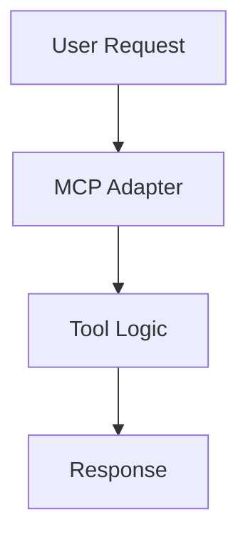

# RFC-{NUMBER}: {TITLE}

**Date**: {DATE}  
**Author**: {AUTHOR}  
**Status**: Draft | In Review | Accepted | Rejected | Implemented  
**Implementation**: [Link to PR when ready]  
**Tracking Issue**: #{ISSUE_NUMBER}

## Executive Summary

{One paragraph that explains the proposal in simple terms. A non-technical
person should understand what we're doing and why.}

## Context and Problem Statement

{Why are we solving this problem now? What triggered this RFC? Include relevant
background, pain points, and why the status quo is insufficient.}

## Goals

- {Specific, measurable objective}
- {What success looks like}
- {Clear acceptance criteria}

## Non-Goals

- {What we explicitly won't do}
- {Scope boundaries to prevent scope creep}
- {Future work that's out of scope}

## Proposed Solution

### High-Level Design

{Architecture diagram and conceptual explanation. Include ASCII diagrams or
mermaid charts.}



### Detailed Design

{Implementation details, algorithms, data structures. Be specific enough that
someone could implement from this.}

### API Design

{If applicable, show the exact API interface with types and examples}

```rust
pub trait ToolInterface {
    async fn execute(&self, input: Input) -> Result<Output>;
}
```

### User Experience

{How will users interact with this? Include examples of usage.}

```bash
# Example usage
tapestry tool execute --name "tool-name" --input "data"
```

## Alternatives Considered

### Alternative 1: {Name}

**Description**: {What is this alternative?}

**Pros**:

- {Advantage}
- {Another advantage}

**Cons**:

- {Disadvantage}
- {Another disadvantage}

**Why not chosen**: {Clear reasoning why the proposed solution is better}

### Alternative 2: {Name}

{Repeat structure as above}

## Trade-offs and Considerations

### Performance

- **Impact**: {How does this affect performance?}
- **Benchmarks**: {Expected metrics}
- **Mitigation**: {How to handle performance concerns}

### Complexity

- **Added Complexity**: {What complexity does this add?}
- **Justification**: {Why is the complexity worth it?}
- **Simplification Opportunities**: {How can we keep it simple?}

### Maintenance

- **Long-term Burden**: {Ongoing maintenance needs}
- **Documentation Needs**: {What documentation is required?}
- **Knowledge Transfer**: {How do we ensure team can maintain this?}

## Security and Privacy

### Security Implications

- {Potential security risks}
- {Authentication/authorization changes}
- {Data exposure concerns}

### Mitigations

- {How each risk is addressed}
- {Security best practices to follow}

### Privacy Considerations

- {User data handling}
- {Compliance requirements (GDPR, etc.)}

## Migration Plan

### Phase 1: {Initial Phase}

- {Steps to take}
- {Timeline}
- {Success criteria}

### Phase 2: {Next Phase}

- {Steps}
- {Dependencies}

### Rollback Plan

- {How to undo if things go wrong}
- {Data migration reversal}

## Testing Strategy

### Unit Tests

- {What to test at unit level}
- {Coverage targets}

### Integration Tests

- {Integration points to test}
- {Test scenarios}

### Performance Tests

- {Benchmarks to run}
- {Performance criteria}

### User Acceptance Tests

- {How to validate with users}

## Dependencies

### Internal Dependencies

- {Other parts of Tapestry affected}
- {Required changes in other modules}

### External Dependencies

- {New libraries or services needed}
- {Version requirements}

## Timeline and Milestones

| Milestone            | Target Date | Description          |
| -------------------- | ----------- | -------------------- |
| Design Approval      | {DATE}      | RFC accepted         |
| Implementation Start | {DATE}      | Begin coding         |
| Alpha Release        | {DATE}      | Internal testing     |
| Beta Release         | {DATE}      | External testing     |
| GA Release           | {DATE}      | General availability |

## Open Questions

- [ ] {Question that needs an answer before proceeding}
- [ ] {Decision that needs to be made}
- [ ] {Unknown that needs investigation}

## Success Metrics

How do we know this is successful?

- {Metric 1}: {Target value}
- {Metric 2}: {Target value}
- {User satisfaction}: {How measured}

## References

- [Related RFC #1](link)
- [External Documentation](link)
- [Prior Art](link)
- [Research Papers](link)

## Appendix

### A. Detailed Calculations

{Any complex math or algorithms}

### B. Data Examples

{Sample data structures or payloads}

### C. Error Scenarios

{Comprehensive list of error cases}

---

## Review Checklist

Before submitting this RFC:

- [ ] Problem is clearly stated
- [ ] Solution addresses the problem
- [ ] Alternatives are thoroughly considered
- [ ] Trade-offs are explicitly documented
- [ ] Security implications reviewed
- [ ] Performance impact assessed
- [ ] Migration plan is realistic
- [ ] Success metrics are measurable
- [ ] Open questions are identified

## Decision Record

**Decision Date**: {DATE}  
**Decision**: {Accepted/Rejected}  
**Reasoning**: {Why this decision was made}  
**Approvers**: {List of approvers}
